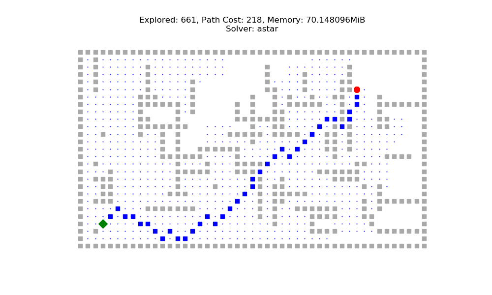

# Searching-in-AI

This repository contains the code for animations used in the article series Searching in AI.

### Part 1

Part 1 explores the famous graph traversals DFS, BFS and Dijkstra's algorithm.
The article is available on Towards Data Science:

| Algorithm | Animation | YouTube Link |
| --------- | --------- | ------------ |
| BFS on small grid | [BFS on Small Grid](bfs_small.mp4) | https://youtu.be/PPUUExeJT8Y |
| DFS on small grid| [DFS on Small Grid](dfs_small.mp4) | https://youtu.be/jKywSkdqro0 |
| Dijkstra's algorithm on small grid | [Dijkstra's algorithm on small grid](ucs_small_with_weights.mp4) | https://youtu.be/XfQpsY2TFl4 |
| BFS on large grid | [BFS on large grid](bfs_large_with_weights.mp4) | https://youtu.be/Jpprm64_5qs |
| DFS on large grid | [DFS on large grid](dfs_large_with_weights.mp4) | https://youtu.be/gfcNxQr4XdM |
| Dijkstra's Algorithm on large grid | [UCS on large grid](ucs_large_with_weights.mp4) | https://youtu.be/4lE-VvYp4aI |

### Part 2

`Working`

### Part 3

`Working`
